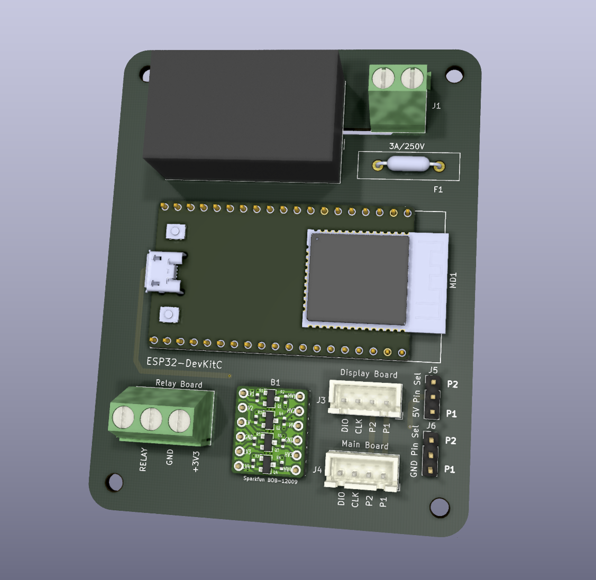
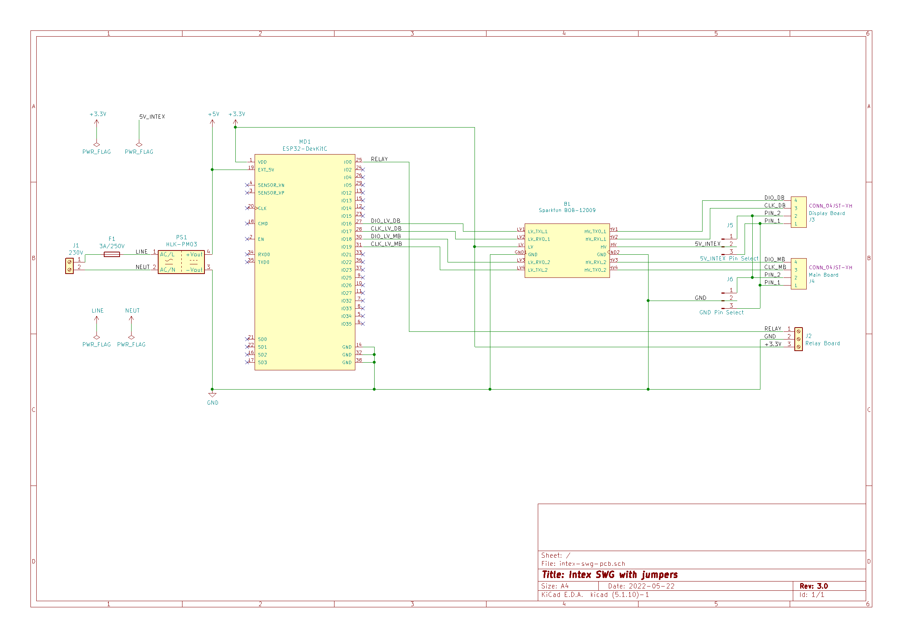

# Intex SWG automaton

NOTE:
Work in progress, not verified that the PCB is is correct

This is a PCB for Intex SWG Automation at
https://github.com/tonyflores1006/intex-swg-iot

Discussion here
https://www.troublefreepool.com/threads/automation-of-intex-swg.228606/

*PCB for Intex SWG automation*

## Schematic

Link to [PDF Schematic](docs/schematic.pdf)

