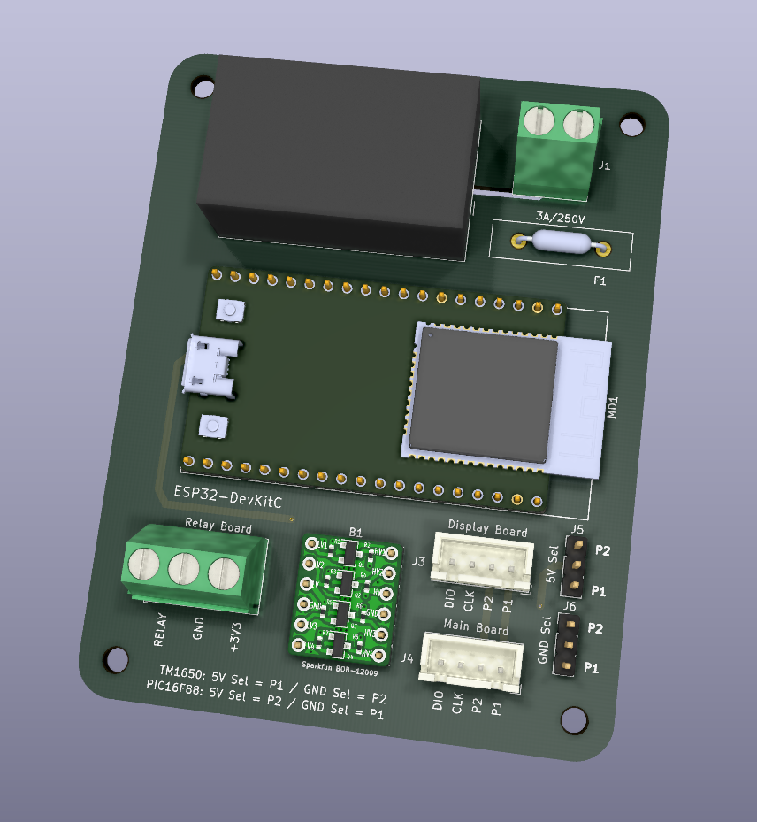
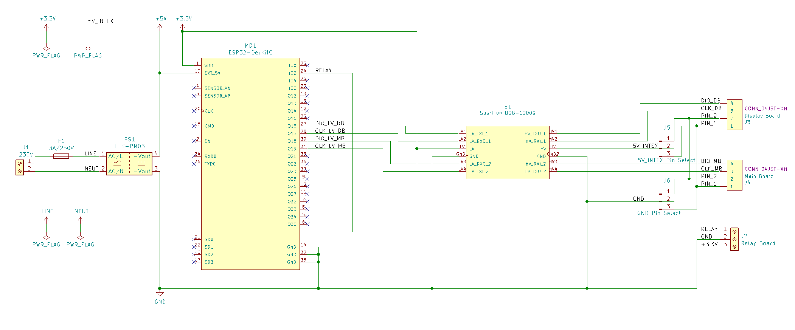

# Intex SWG automaton

This is a PCB for Intex SWG Automation at
https://github.com/tonyflores1006/intex-swg-iot

Discussion here
https://www.troublefreepool.com/threads/automation-of-intex-swg.228606/

This PCB is suitable for both the TM1650 and the PIC16F88 version of the display board.

*PCB for Intex SWG automation*

## Schematic

Link to [PDF Schematic](docs/intex-swg-pcb.pdf)

