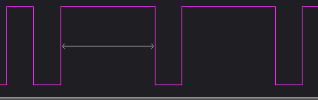
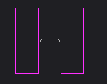
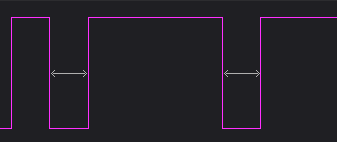
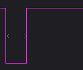
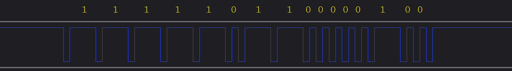
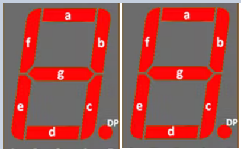
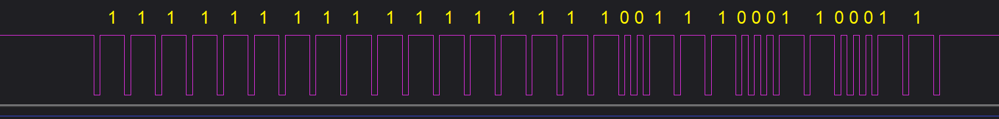
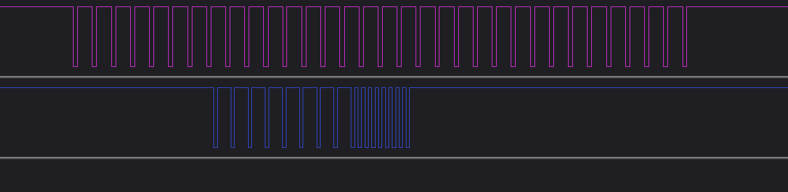

# Intex SWG (without TM1650 LED6 driver) protocol

Some Intex SWG models do not contain the TM1650 LED driver chip
This document contians the protocol for the communication between the Main/Displayboard for these models.

Discussion here
https://www.troublefreepool.com/threads/automation-of-intex-swg.228606/

Known models without the TM1650 chip:
* Intex Krystal Clear salt water system® ECO 6220 / CG-26670 (7-led/5 buttons), Max 56800 Liters

## General signal information

---
#### Note:  The information below is based on the asumption that the encodig is done with a high pulse. This is for decoding purposes. It might also be possible to consider the encoding scheme as "Short-Low,Long-High" as "one. and "Short-Low, Short-High" as Zero. Or alternativly as "Long-High,Short-Low" as "one. and "Short-High,Short-Low, " as Zero

* Starts with a Low 200 μS pulse
* Long High 800 μS for "one", followed by a Low 200 μS pulse as "spacer" 
* Short High 200 μS for "zero", followed by a Low 200 μS pulse as "spacer" 
* Ends with returning to high

---

The communication from the displayboard to the main board (buttons), uses the line marked as "CLK"  
*ESP32: IO17 input from display board, IO19 output to mainboard*

The communication from the main board to the displayboard (7-segment and LEDs), uses the line marked as "DIO"  
*ESP32: IO18 input from main board, IO16 output to displayboard*  

The data lines is normally high  
  

A "one" is a long high pulse with the following characteristics:  
  
Long High 800 μS

A "zero" is a short high pulse with the following characteristics:  
  
Short High 200 μS

Inbetween the data signals, there is a short low 200μS  
  
Short Low 200 μS

The transmission ends with a Short Low of 200μS  
  

## Communication from display board (buttons) to main board

The data from the buttons to the main board consists of two 8 bit values (bytes), where the second byte is the inverted of the first byte

The buttons is arranged in as a "plus", with a center button. They are named N, S, E, W, and C in the following table
~~~
             
             N SCEW  Button pressed  
1111 1011 0000 0100  C 
1111 1101 0000 0010  E 
1111 1110 0000 0001  W 
1110 1111 0001 0000  N 
1111 0111 0000 1000  S 
1111 1100 0000 0011  EW
1110 0111 0001 1000  NS
1110 1110 0001 0001  WN
1111 0110 0000 1001  WS
1110 1101 0001 0010  EN
1111 0101 0000 1010  ES
1111 1111 0000 0000  Release Buttons
---- ---- 
Inverted
of second
byte
~~~

*Example*
 
*C-button (Power) is pressed*

When the buttons are released the display board transmits
~~~
1111 1111 0000 0000
~~~

On the CG-26670 model, the buttons coresponds to:

N = Boost  
S = Self-Clean  
W = Lock/Unlock  
E = Timer  
C = Power  

## Communication from the main board to display board (7-segment and LEDs)

The data from the main board to the display board (7-segments/and LEDs), consists of a 32 bit value.
The first 16 bits is used for the two 7-segment displays, the last 16 bits for LEDs and status.

 

~~~
Left Disp RightDisp 
.gfe dcba .gfe dcba                     Display/LEDs shows
0011 1111 0000 0110 0000 1100 0000 0000 01
0011 1111 0101 1011 0000 1100 0000 0000 02
0000 0110 0011 1111 0000 0100 0000 0000 10
0000 0110 0000 0110 0000 1100 0000 0000 11
0000 0110 0101 1011 0000 1100 0000 0000 12 t0 - "Working" LED On
0000 0110 0101 1011 0000 0100 0000 0000 12 t1 - "Working" LED Off
0000 0110 0101 1011 0000 1100 0000 0000 12 t2 - "Working" LED On
0000 0110 0101 1011 0000 0100 0000 0000 12 t3 - "Working" LED Off
0000 0110 0101 1011 0000 1100 0000 0000 12 t4 - "Working" LED On

0110 1111 0011 1111 0000 0100 0100 0000 90 "Pump Low flow" LED on 
0111 1111 0011 1111 1000 0100 0000 0000 80 "Boost" LED on

1000 0000 0000 0000 0000 0000 0000 0000 Off ("Off", only left "." lights)

Last 16-bits (LED Format):

Left-Disp RightDisp
.gfe dcba .gfe dcba o--s wz-- -pl- --ir
0000 0000 0000 0000 1001 1100 0110 0011 (All 7-segment off, all LEDs on)

o = Boost LED
s = Sleep LED
w = Working LED
z = Ozone LED
p = Pump low flow LED
l = Low salt LED
i = High salt LED
r = Service LED
~~~

There is space for a "Ozone" led on the PCB, not populated on my PCB, that bit is always high when the SWG is powered on, on my SWG.

The mainboard sends the whole 32-bit sequence when blinking LEDs, just toggling the one bit, for the LED thats blinking.

*Example of complete 32-bit display-data sequence*
 
*All 7-segments, and LEDs are "on"*

## Power-on
On power-on,  the mainboard sends all 32 bits as "one" to the display board, which lights up everything. One second later, 
it sends all 32 bits as "zero", except the first bit, witch is sendt as "one". This corresponds to just showing the "." in the display.
 
The display boards sends all "Release Button" to the main board, 8 bits of "one", and 8 bits of "zero"

 

## Code Samples

---
#### Note2: The Code samples below, basically looks for a falling pulse edge, and then measures the time before a falling edge occurs again to detect a "0" or "1"

The following code sample allows the ESP32 to sit "in the middle" between the display and main board. I does not decode the traffic, but prints all rising/falling transitions of the received signals, on the serial bus.  
[Demo_ESP32_Middle](Code\Demo_ESP32_Middle\Demo_ESP32_Middle.ino)

The following code sample allows the ESP32 to send different LED patterns to the display board.  
[Demo_ESP32_Display](Code\Demo_ESP32_Display\Demo_ESP32_Display.ino)

The following code sample allows the ESP32 to DEMO the following sequernce: Push the Power button, Push the Lock/Unlock Key, Push the Timer button 6-times, Push the Lock/Unlock Key, and at last Push the power Button. Repeats the sequence after 10 Seconds  (Includes some Demo_ESP32_Middle code to allow the SWG to work)  
[Demo_ESP32_Buttons](Code\Demo_ESP32_Buttons\Demo_ESP32_Buttons.ino)

The following code sample allows the ESP32 to read, and print on the serial bus, the buttons pressed on the display board (Includes some Demo_ESP32_Middle code to allow the SWG to work)  
[Demo_ESP32_ReadButtons](Code\Demo_ESP32_ReadButtons\Demo_ESP32_Buttons.ino)

The following code sample allows the ESP32 to read, and print on the serial bus, the information sendt from the main board to the display board (Includes some Demo_ESP32_Middle code to allow the SWG to work)  
[Demo_ESP32_ReadDisplay](Code\Demo_ESP32_ReadDisplay\Demo_ESP32_ReadDisplay.ino)

The following code sample uses code from all the above samples, to decode and display all data between the main board and the displayboard  
[Demo_ESP32](Code\Demo_ESP32\Demo_ESP32.ino)
